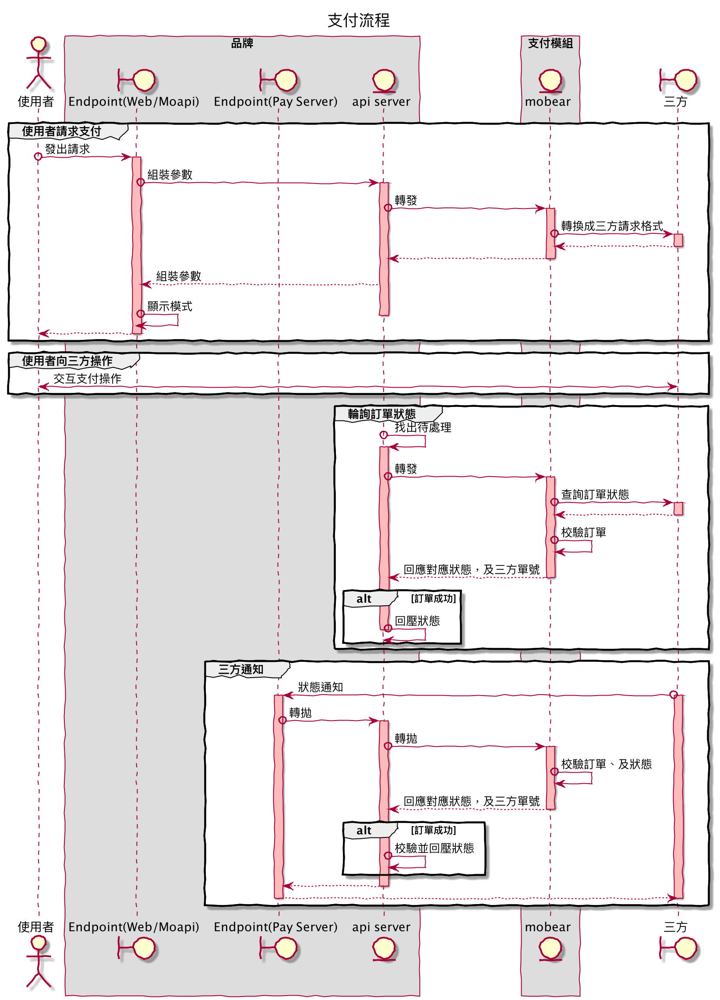

# payV2

- [payV2](#payv2)
  - [包板及部署](#包板及部署)
    - [懶人包](#懶人包)
    - [包版](#包版)
    - [部署](#部署)
    - [Config](#config)
    - [白名單](#白名單)
  - [其他注意事項](#其他注意事項)
  - [開發邏輯](#開發邏輯)
    - [支付下單](#支付下單)
    - [回調通知](#回調通知)
    - [訂單查詢](#訂單查詢)
    - [Config](#config-1)
  - [DEV測試方法](#dev測試方法)
    - [平台前置作業](#平台前置作業)
    - [mobear 包測試](#mobear-包測試)
    - [測試流程](#測試流程)
  - [交易流程](#交易流程)

## 包板及部署

### 懶人包

1. 用 mobear/payv2/build 底下的 sh 或 bat 包板
2. 會打包出 tar 檔
3. 到 [jenkins](https://jenkins.paradise-soft.com.tw/job/Deploy/job/Prod/job/DeployScript/job/mobear-pay-name/) 上傳打包好的 tar

### 包版

包版為**手動打包執行檔**後給 **IT** 部署

把包腳本 `build/buildV2.bat` or `build/buildV2.sh`

打包時輸入支付名稱，支付成稱為 `payment/xxx.go` 下的 build tag

支付名稱範例： 
```text
//+build goubao

package payment
```

包版檔案輸出會在 `build/out/64/mobear-pay/` 下

tar.gz 會在 `build/` 下

檔名為 `mobear-pay-{支付名稱}.tar.gz`

### 部署

Jenkins

### Config

服務的設定檔 `mobear/payv2/yaml/{支付名稱}.yml`

因為一個支付就是一個服務，以 `grpc` 方式讓其他服務呼叫，所以裡面的 port 不能重複。

呼叫的服務為 `xunya-apis`, `xunya-service` 要請 IT 幫這兩個服務加設定檔，`payment.conf`

config 內容範例
```
[service]
bee=10.140.0.2:6000
bull=10.140.0.2:6001
tenmega_qr=10.140.0.2:6002
```

### 白名單

品牌端服務有三個 `web`、`app`、`pay server`，要通知 CDN 要在這三個服務上加白名單

名稱與專案對應

- `web` 為 `web/base`
- `app` 為 `mobile-api`
- `pay server` 不確定是哪個服務

## 其他注意事項

內部使用套件非常舊，有先搞了一版 go mod vendor 避免套件載不到無法開發的情況

## 開發邏輯

主要 func `支付下單(PayViaURL)`、`回調通知(PayValidate)`、`訂單查詢(PayQuery)` 

呼叫順序大部分都是 `支付下單` >> `回調通知` >> `訂單查詢`

### 支付下單 

func PayViaURL

我方 > 三方

```text
PayViaURL(ctx context.Context, req *sdks.PayRequest) (payurl *sdksType.String, err error)
```

Req 重要的參數

- 轉帳金額 `req.Data.GetTransferAmount()`
- 商戶編碼 `req.Merch.GetAccount()`
- 商戶密鑰 `req.Merch.GetAppSecret()`
- 品牌訂單號 `req.Data.GetId()`
- 品牌轉帳方式 `req.Data.GetTransferMethod()`
- 回調地址 `req.Ctx.GetNotifyUrl()`、`req.Merch.GetUrlNotify()`
  - `req.Ctx.GetNotifyUrl()` 品牌前台給的通知地址 
    - 格式 `baseUrl + "/pay/" + id + "/notify"`，`baseUrl` 為玩家請求時品牌前端的 domain 
  - `req.Merch.GetUrlNotify()` 品牌後台設定的通知地址
    - 通常是 `pay server` 的 domain
  - 通常會需要把`前台`給的 domain 轉換成 `pay server` 的 domain 
    - 可使用 `app.ReplaceBaseURL(req.Ctx.GetNotifyUrl(), req.Merch.GetUrlNotify())`
  - 轉帳過程的通知，`xunya` 服務會判斷是否成功回壓訂單
  - 不一定會有 IP 串接時可下 log 觀察
  - 品牌收到後會呼叫 `xunya` `"/v1/webdeposit/" + id + "/payment/callback"`
  - ！！！注意：三方通常只會有一個回調地址，而且只通知成功，所以通常是給三方這個地址
- 回調地址 `req.Ctx.GetSuccessUrl()`
  - 不知道用途，品牌端不會處理帳務，單純被呼叫而已
  - 對應品牌 `baseUrl + "/pay/" + id + "/success"`
  - 品牌收到後會呼叫 `xunya` `"/v1/webdeposit/" + id + "/payment/validate"`
- 回調地址 `req.Ctx.GetFailUrl()`
  - 不知道用途，品牌端不會處理帳務，單純被呼叫而已
  - 對應品牌 `baseUrl + "/pay/" + id + "/failure"`
  - 品牌收到後會呼叫 `xunya` `"/v1/webdeposit/" + id + "/payment/validate"`

Resp 

- `payurl *sdksType.String`
  - 對方回覆的轉向地址
- error
  - 過程中任何錯誤都回應 error

### 回調通知

func PayValidate

三方 > 我方 

通常只處理成功狀態，只要訂單狀態不是`成功`時就回 error

品牌端判斷`成功`時會觸發流程，更新會員訂單狀態，更新者名稱會是 `$notify`

看 `xunya` 的 code 有 error 就噴錯而已

```text
PayValidate(ctx context.Context, req *sdks.PayValidateRequest) (ret *sdks.PayValidateResult, err error)
```

Req 重要的參數

- 參數大概跟`支付下單`相同
- 三方的IP req.Ctx.GetNotifyIp()
  - 可搭配 config 的 WhiteList 來使用
- 對方 req 內容
  - `req.Ctx.GetNotifyUrl()`
  - `req.Ctx.GetNotifyForm()`
  - Request 方式
    - `query string` or `form` 可以使用 `app.GetQueryFromRequest(req)` 取得請求參數
    - `json` 使用 `req.Ctx.GetNotifyForm()` 直接取出 request data 來 json.Unmarshal

`query string` or `form` 解析範例
```text
	query, err := app.GetQueryFromRequest(req)
	if err != nil {
		...
		return
	}

	validateData := &payValidateData{
		RetCode:   query.Get("retCode"),
		UserId:    query.Get("userId"),
		OrderNo:   query.Get("orderNo"),
		TransNo:   query.Get("transNo"),
		PayAmt:    query.Get("payAmt"),
		GoodsDesc: query.Get("goodsDesc"),
		Sign:      query.Get("sign"),
	}
```

`json` 解析範例
```text
	notifyForm := req.Ctx.GetNotifyForm()
	validateData := &payValidateData{}
	err = json.Unmarshal([]byte(notifyForm), validateData)
	if err != nil {
		...
		return
	}
```


Resp

- `ret *sdks.PayValidateResult`
  - `ret.Result = NotifySuccess` 對方要求的回應狀態
  - `ret.Transid = validateData.SystemOrderID` 對方的訂單號，如果成功時會寫入我方的 DB
- error
  - 過程中任何錯誤都回應 error


ret *sdks.PayValidateResult

### 訂單查詢

func PayQuery

我方 > 三方

我方向第三方查詢訂單，只要訂單狀態不是`成功`時就回 error

品牌端判斷`成功`時會觸發流程，更新會員訂單狀態，更新者名稱會是 `$auto`

```text
PayQuery(ctx context.Context, req *sdks.PayQueryRequest) (ret *sdks.PayQueryResult, err error)
```

Req 重要的參數

- 參數大概跟`支付下單`相同


Resp

- `ret *sdks.PayValidateResult`
  - `ret.Result = NotifySuccess` 對方要求的回應狀態
  - `ret.Transid = validateData.SystemOrderID` 對方的訂單號，如果成功時會寫入我方的 DB
- error
  - 過程中任何錯誤都回應 error

### Config

路徑：`payv2/yaml`

```text
section_name: "服務名稱"
# api 取得三方地址倒轉到三方都用這個
name: "host.url" 
# 不能重複
port: 6144
# 三方的地址
pay_url : "https://api.hm-pays.com/gateway/index"
query_url: "https://api.hm-pays.com/gateway/query"
# api 取得三方地址倒轉到三方都用這個
pay_mode: "Redirect"
# api 三方地址白名單
white_list:
  - "23.97.67.239"
channel:
```

## DEV測試方法

### 平台前置作業

IT 有在`環境 DEV` `品牌 c7` 的 `xunya-apis`, `xunya-servuce` 的設定上增加一個固定測試 rpc server 路徑 

```
[service]
paytest=mobear-test-srv.platform.svc.cluster.local:6000
```

DB 的 payment 增測試的 `code` ， 這個 `code` 與設定檔的 `label` 互相對應

語法

```sql
DELETE FROM `payment` WHERE `code` = 'paytest';
INSERT INTO `payment`(`code`, `name`, `charge`, `status`, `type`) VALUES ('paytest', 'TEST', NULL, 1, 0);
```

### mobear 包測試

Step 1. 將 `tag` 註解

```text
////+build hmzhifu
```

Step 2. 將放在 `yaml` 資料夾底下的該服務設定檔內容複製到專案根目錄下的 `payconf.yml`

要將 `port` 改成 6000
   
```yaml
section_name: "hmzhifu"
name: "host.url"
port: 6000
pay_url : "https://api.hm-pays.com/gateway/index"
query_url: "https://api.hm-pays.com/gateway/query"
pay_mode: "Redirect"
white_list:
  - "23.97.67.239"
channel:
```

Step 3. 使用 Makefile 的指令，打包 image

image 為 `reg.paradise-soft.com.tw:5000/mobear-test-srv:latest`

```
make ci
```

Step 4. 上 [Rancher](https://rancher.paradise-soft.com.tw/p/c-2j6qs:p-lw8lj/workloads) 重新部署

```
Namespace: platform
Name: mobear-test-srv
```

### 測試流程

Step 1. 到 [Admin](http://c7-admin-dev.paradise-soft.com.tw/merchant) 後台新增商號 `财务管理 > 账号管理 > 在线商号`

- 支付方式
  - 約定好的支付方式，如過三方有特殊的支付方式就需要新增。
  - 對應 `req.Data.GetTransferMethod()`
- 支付網關
  - DB 增加的 `payment`
- 商家編號
  - 約定好的商戶號
  - 對應 `req.Merch.GetAccount()`
- 終端編碼
  - 一樣填商戶號
- 商號類型
  - 線上支付
  - PS. 可能會不同
- 所屬分類
  - 線上支付/線上支付(線上支付)
  - PS. 選擇括號內是`線上支付`即可
- 簽名密鑰
  - 約定好的密鑰
  - 對應 `req.Merch.GetAppSecret()`
- 回調地址
  - `{DEV_Dmain}/pay`
  - 例 `https://c7-web-dev.paradise-soft.com.tw/pay`
- 會員級別
  - 如果不知道品牌帳號是哪個級別就全部打勾
  
Step 2. 到 [web](https://c7-web-dev.paradise-soft.com.tw/my/charge) 前台頁面`線上存款`功能，選擇剛剛設定的`所屬分類`，選擇設定的商戶進行入款。

Step 3. 後續觀察頁面是否有打通，也可到 Rancher 上看 log

Step 4. 很有可能流程走到一半就卡住，後續的只能請客戶測試

## 交易流程


